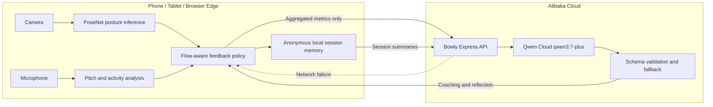

# Bowly AI Architecture

Bowly is submitted to the **EdgeAgent** track. The browser acts as the edge
runtime: it senses posture and audio locally, protects the child's practice
flow, and sends only compact practice metrics to Qwen Cloud for higher-level
reasoning.

## Edge Responsibilities

- Camera pose inference and guide rendering run locally for low latency.
- Microphone activity and pitch signals are processed locally.
- Raw camera frames are not sent to Qwen Cloud or stored in reports.
- Anonymous joint coordinates can be saved for before/after reflection.
- A deterministic feedback policy decides when the child should not be
  interrupted.

## Qwen Cloud Responsibilities

- Convert structured practice metrics into calm, child-appropriate coaching.
- Generate parent-facing session reports.
- Summarize trends across saved practice sessions.
- Return validated JSON so the product can render predictable UI.

## Graceful Degradation

If Qwen Cloud is unavailable, Bowly records a visible `Mock fallback` state and
continues local posture tracking, audio analysis, session recording, and
rule-based feedback. This keeps the physical practice workflow usable on weak
mobile networks.

## Privacy Boundary

Only structured metrics and text are sent to the backend. The current Qwen
requests do not contain images, audio recordings, faces, clothing, or room
details.
